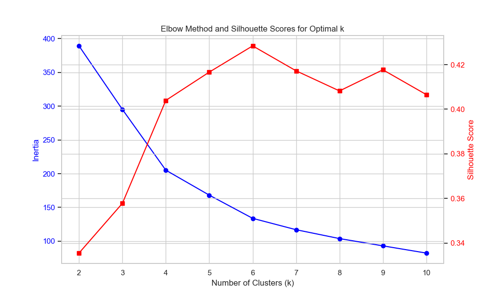
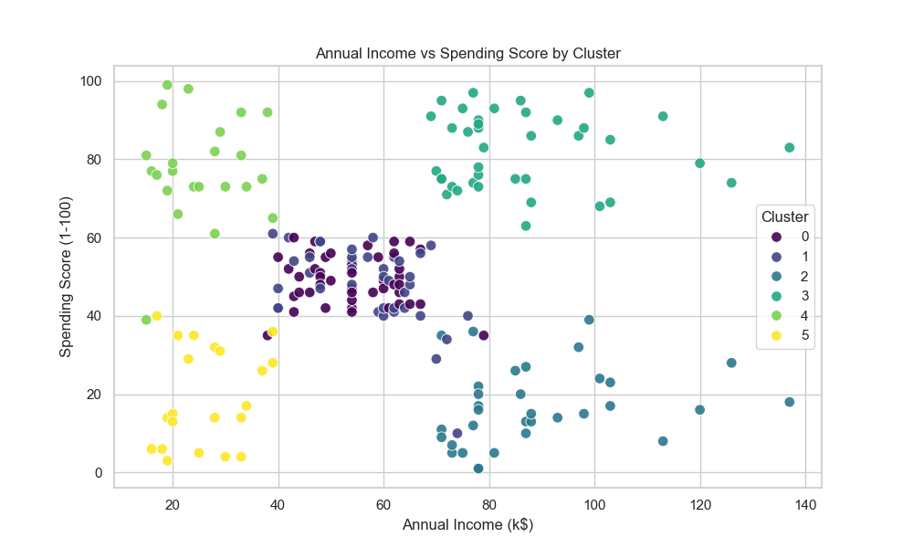
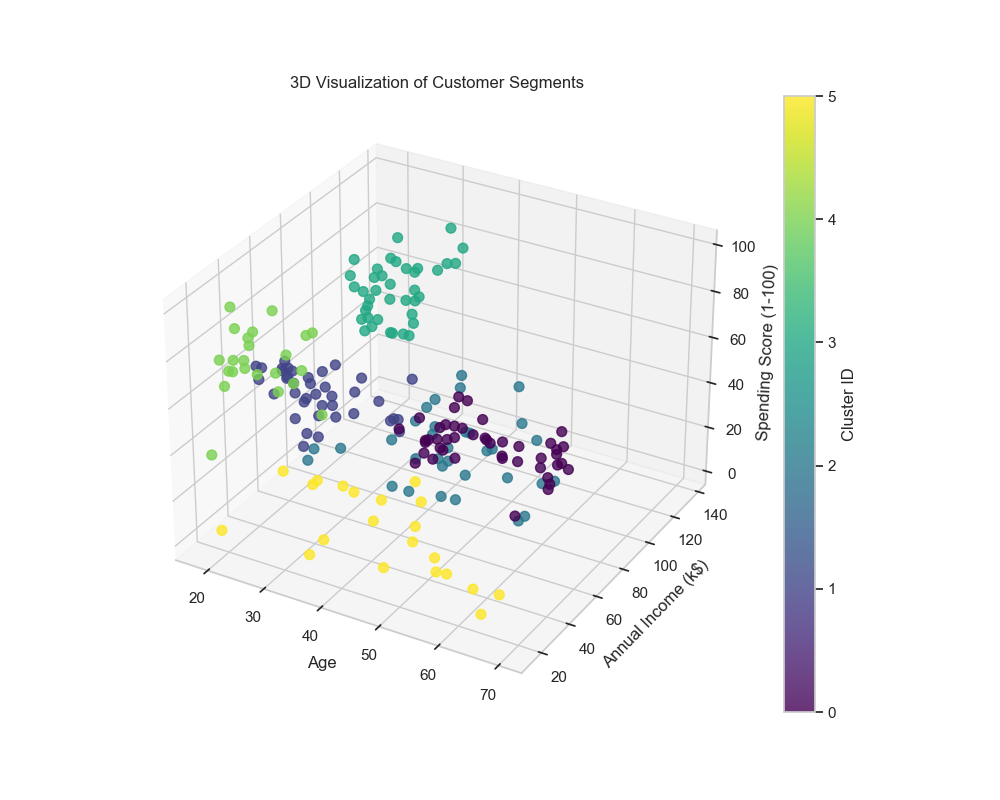
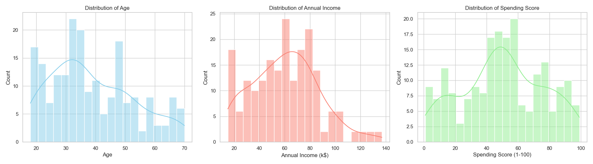

<div align="center">

# `CUSTOMER SEGMENTATION`

**K-Means clustering for customer persona analysis**


*Enter a customer profile. See which segment they belong to.*

[**Live Demo**](https://customer-segmentation-apeu.onrender.com)

</div>

---

## 🔍 About

> [!IMPORTANT]
> **Model Training Notebook**: The full pipeline - data loading, EDA, scaling, elbow analysis, clustering, and profiling - is available in [`customer_segmentation.ipynb`](notebooks/customer_segmentation.ipynb).

This is a customer segmentation tool that takes age, annual income, and spending score for any customer profile and classifies it into one of six behavioral segments using a K-Means model trained on 200 real mall customers.

The interface is split into two pages. A landing home page explains what the tool does in plain language, walks through the four-step process (data collection, clustering, persona profiling, interactive mapping), details the model mechanics behind the K-Means algorithm, and previews all six customer groups. A "Find Your Segment" button navigates to the interactive tool page, where a visitor enters a customer profile and sees the matched segment card expand in-place with recommended marketing strategies, while the other five segments recede for focus.

The backend is a FastAPI app that loads the StandardScaler and K-Means model once at startup and serves predictions from memory. The frontend is hand-crafted HTML, CSS, and JavaScript with an editorial ledger layout that pairs Lora (serif) for headings and segment names with Inter (sans-serif) for body and tabular statistics. All content is written in plain language by default, with no jargon-only mode or toggle required.

> [!NOTE]
> The model uses k = 6 clusters, chosen by combining the elbow method with silhouette analysis. The silhouette score peaks at 0.4284 for k = 6, confirming that six clusters provide the most cohesive and well-separated grouping across all three features.

---

## ✨ Features

### Core Segmentation Engine

- **Instant Classification** - Enter any combination of age, income, and spending score. The model scales the input using the same StandardScaler used during training and returns the nearest cluster assignment in milliseconds.

- **Six Distinct Personas** - Each cluster maps to a named persona with a profile description and a recommended marketing strategy. The personas are derived from the actual cluster center statistics, not invented labels.

- **Scrollable Segment Roster** - A scrollable container housing the six customer segments, reordered by average age (increasing order) and numbered from Segment 1 to Segment 6. The container matches the vertical bounds of the entry form, creating a perfectly balanced desktop layout.

- **Model Mechanics Section** - A dedicated explanation section on the homepage details the four key elements of the classification model: Feature Scaling, Distance Minimization, Iterative Refinement, and Real-Time Assignment.

> [!TIP]
> The personas are based on real cluster center values. For example, the "High-Value Trendsetters" segment has an average income of $87k and an average spending score of 82/100. These are computed directly from the 39 customers in that cluster.

### UI and Experience

- **Two-Page Flow** - A landing home page covers the explanation and segment previews. A separate tool page hosts the profile input form and segment roster. Navigation between them uses plain links styled to match the archive aesthetic.

- **Plain Language Throughout** - Every input field, section heading, and segment card includes a plain-language annotation explaining what it means, visible by default with no toggle required.

- **Ledger Aesthetic** - A warm paper background (`#F2EFE9`), near-black text (`#211E1B`), and clean hairline dividers. No glow effects or generic SaaS card boxes.

- **Continuous Color Scale** - A warm-to-cool palette derived from spending score (from terracotta for high spenders to deep slate for conservative spenders) representing real meaning.

- **Responsive** - Works cleanly on mobile and desktop. On narrow viewports the form and roster deck stack vertically, and the stats grid shifts from a 4-column to a 2-column layout.

- **Accessible** - Semantic HTML, focus-visible outlines on all interactive elements, and a prefers-reduced-motion media query that disables card transitions.

### Backend and API

- **Single-Load Model** - The joblib bundle containing both the StandardScaler and the K-Means model is deserialized once at server startup. Every request after that reads from memory.

- **Pydantic Validation** - All request bodies are validated against strict field constraints before reaching the model. Out-of-range values (negative age, spending score above 100) get a clean 422 response.

- **Bundled Scaler and Model** - The StandardScaler and KMeans model are saved together in a single joblib file, ensuring that the exact same feature scaling used during training is applied at inference time.

- **Auto-Generated API Docs** - FastAPI provides Swagger UI at `/docs` with no extra configuration. Every endpoint is documented with request/response schemas and examples.

---

## 🛠️ Built With

| Technology | Role in this project |
|---|---|
|  | Core runtime for data processing, model training, and the API server |
|  | StandardScaler for feature normalization and K-Means for unsupervised clustering |
|  | Prediction and health API with automatic Pydantic validation and Swagger docs |
|  | ASGI server that runs FastAPI with async I/O support |
|  | Loads and processes the 200-row Mall Customer Segmentation dataset |
|  | Semantic page structure with accessible ARIA labels and live regions |
|  | Custom design system with CSS variables and segment-specific color tokens |
|  | API calls, state management, result card rendering, and segment map highlighting |

The stack was chosen deliberately. K-Means is fast, interpretable, and well-suited to behavioral segmentation on low-dimensional continuous data. FastAPI keeps the backend minimal while auto-generating docs. Vanilla frontend because this app does not need a framework to render a form and a result card.

---

## 📊 Model Evaluation

These plots are generated during training and saved to `notebooks/`.

<div align="center">

### Elbow Method and Silhouette Scores


*The inertia curve shows a clear inflection at k = 5-6, and the silhouette score peaks at k = 6 (0.4284).*

<br/>

### 2D Cluster Visualization


*Annual Income vs Spending Score colored by cluster. The six groups are visually well-separated in this projection.*

<br/>

### 3D Cluster Visualization


*Age, Income, and Spending Score plotted together. Each cluster occupies a distinct region of the feature space.*

<br/>

### Feature Distributions


*Distribution of Age, Annual Income, and Spending Score across all 200 customers before clustering.*

</div>

---

## ⚙️ Technical Details

### Project Structure

```
Customer Segmentation/
├── app/
│   └── main.py                 # FastAPI app - routes, validation, segment prediction
├── notebooks/
│   └── customer_segmentation.ipynb   # Full training, evaluation, and plot generation
├── data/
│   ├── Mall_Customers.csv      # 200-row Mall Customer Segmentation dataset
│   └── customer_segments.csv   # Cluster-labeled output from the notebook
├── models/
│   └── customer_segmentation_model.joblib  # Bundled StandardScaler + K-Means model
├── frontend/
│   ├── index.html              # App markup and structure
│   ├── style.css               # Design system, segment colors, responsive layout
│   └── script.js               # API calls, state management, result rendering
├── requirements.txt            # Pinned dependencies
├── .gitignore                  # Git ignore rules
└── README.md
```

### Model Details

| | |
|---|---|
| **Dataset** | Mall Customer Segmentation (200 customers, 5 columns) |
| **Features** | Age, Annual Income (k$), Spending Score (1-100) |
| **Preprocessing** | StandardScaler normalization on all three features |
| **Algorithm** | K-Means clustering with n_init=10 and random_state=42 |
| **Optimal k** | 6 (elbow method + silhouette score peak at 0.4284) |
| **Cluster sizes** | 45, 39, 33, 39, 23, 21 customers |

### Persona Breakdown

| Segment | Name | Avg Age | Avg Income | Avg Spend | Size | Strategy |
|---|---|---|---|---|---|---|
| Segment 1 *(Cluster 4)* | Spender Apprentices | 25 | $25k | 78/100 | 23 | Flash sales and student discounts |
| Segment 2 *(Cluster 1)* | Young Moderates | 27 | $57k | 48/100 | 39 | Social media and subscription offers |
| Segment 3 *(Cluster 3)* | High-Value Trendsetters | 33 | $87k | 82/100 | 39 | Luxury items and personal shoppers |
| Segment 4 *(Cluster 2)* | Affluent Conservatives | 42 | $89k | 17/100 | 33 | Premium goods and VIP invitations |
| Segment 5 *(Cluster 5)* | Budget Conscious | 46 | $26k | 19/100 | 21 | Budget products and clearance sales |
| Segment 6 *(Cluster 0)* | Traditionalists | 56 | $54k | 49/100 | 45 | Loyalty programs and value promotions |

> [!TIP]
> The most striking finding is Segment 1 (Spender Apprentices): young customers earning only $25k on average but spending at 78/100. This group responds well to buy-now-pay-later options and trend-forward low-cost items.

### API Reference

Interactive Swagger docs are available at [`/docs`](http://127.0.0.1:8000/docs) when running locally.

**`GET /health`**

```json
{ "status": "healthy" }
```

**`POST /predict-segment`**

Request body:
```json
{ "age": 25, "annual_income": 90, "spending_score": 85 }
```

Response:
```json
{
  "cluster_id": 3,
  "name": "High-Value Trendsetters",
  "profile": "Young-to-middle-aged customers with high incomes and high spending scores.",
  "marketing_action": "Target with luxury items, new arrivals, high-prestige product launches, and personal shopper services.",
  "mean_age": 32.69,
  "mean_income": 86.54,
  "mean_spending_score": 82.13,
  "size": 39
}
```

All three fields are required. `age` must be 1-120, `annual_income` must be 0-1000, and `spending_score` must be 1-100. Violations return a 422 with a field-level error message.

### 💻 Local Setup

```bash
# 1. Clone the repo
git clone https://github.com/yash5123/Customer-Segmentation.git
cd "Customer-Segmentation"

# 2. Install dependencies
pip install -r requirements.txt

# 3. (Optional) Re-run the notebook
cd notebooks
jupyter notebook customer_segmentation.ipynb
cd ..

# 4. Start the server
uvicorn app.main:app --host 127.0.0.1 --port 8000
```

Open `http://127.0.0.1:8000/` - the frontend is served automatically.

### 🚀 Deployment

Deployed on **Render** as a single web service. FastAPI serves both the API routes and the static frontend from one process - no separate frontend hosting needed.

**Live**: [customer-segmentation-apeu.onrender.com](https://customer-segmentation-apeu.onrender.com)

| Setting | Value |
|---|---|
| **Build command** | `pip install -r requirements.txt` |
| **Start command** | `uvicorn app.main:app --host 0.0.0.0 --port $PORT` |
| **Runtime** | Python 3.13+ |
| **Plan** | Free tier (cold starts up to 90s after inactivity) |

### Package Versions

| Package | Version |
|---|---|
| fastapi | 0.136.1 |
| uvicorn | 0.46.0 |
| scikit-learn | 1.8.0 |
| pandas | 2.3.3 |
| numpy | 2.4.2 |
| joblib | 1.5.3 |

> [!TIP]
> The scikit-learn version **must match** between your training environment and your serving environment. A version mismatch can cause `joblib.load()` to fail or silently alter predictions. Pin the version in `requirements.txt` and do not upgrade it without retraining.

---

<div align="center">

### Made by Yash

[](https://github.com/yash5123)

</div>
